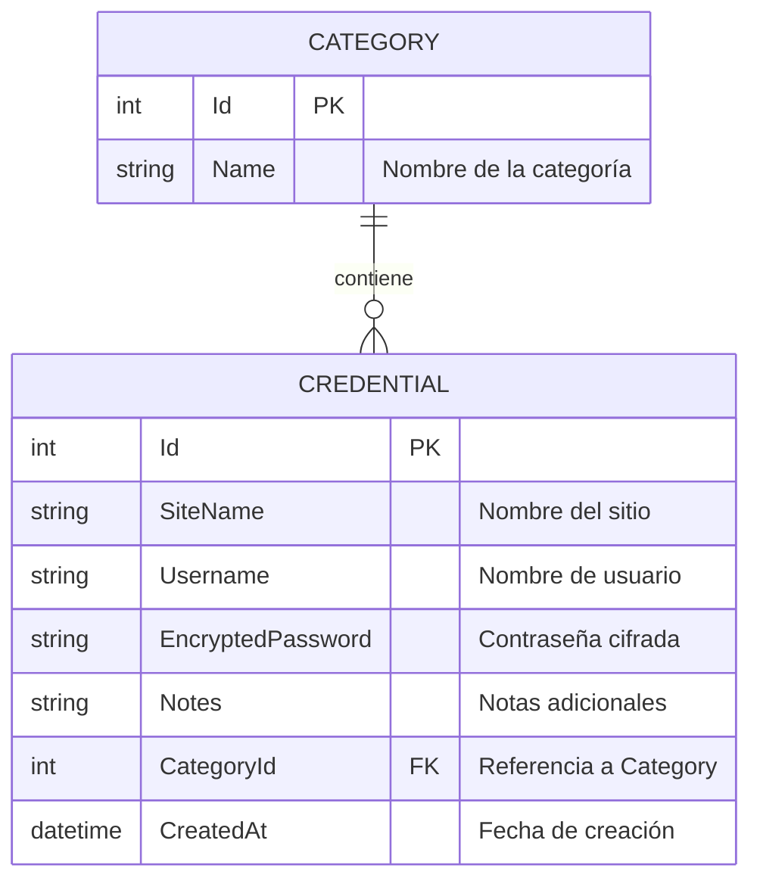

# Diagrama Relacional de la Base de Datos

Este documento detalla la estructura de la base de datos SQLite utilizada por la aplicación **Password Manager**.

## Diagrama Entidad-Relación (Mermaid)

## Detalles de las Tablas

### Tabla: Categories
Almacena las agrupaciones de credenciales (ej. Redes Sociales, Trabajo, Bancos).
- **Id**: Identificador único autoincremental.
- **Name**: Etiqueta descriptiva de la categoría.

### Tabla: Credentials
Almacena la información sensible de las cuentas.
- **Id**: Identificador único autoincremental.
- **SiteName**: Nombre de la aplicación o sitio web.
- **Username**: Usuario o correo electrónico.
- **EncryptedPassword**: Contraseña almacenada de forma segura (cifrada).
- **Notes**: Descripción o información extra opcional.
- **CategoryId**: Clave foránea que vincula la credencial a una categoría.
- **CreatedAt**: Registro temporal del momento en que se creó la entrada.
